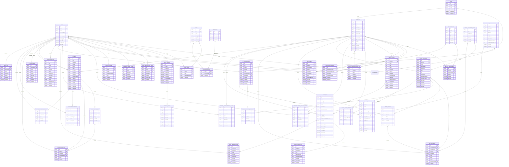

# PlusOps Initial ER Diagram

```mermaid
erDiagram
  USER ||--o{ TEAM_MEMBER : joins
  USER ||--o{ USER_ROLE : has
  ROLE ||--o{ USER_ROLE : assigned
  ROLE ||--o{ ROLE_PERMISSION : grants
  PERMISSION ||--o{ ROLE_PERMISSION : included
  USER ||--o{ AUTH_SESSION : owns
  AUTH_SESSION ||--o{ REFRESH_TOKEN : rotates
  USER ||--o{ EMAIL_VERIFICATION_TOKEN : verifies
  USER ||--o{ PASSWORD_RESET_TOKEN : resets
  USER ||--o{ OAUTH_ACCOUNT : links
  TEAM ||--o{ TEAM_MEMBER : has
  TEAM ||--o{ SERVICE : owns
  SERVICE ||--o{ SERVICE_ENVIRONMENT : runs_in
  ENVIRONMENT ||--o{ SERVICE_ENVIRONMENT : hosts
  SERVICE ||--o{ SERVICE_DEPENDENCY : upstream
  SERVICE ||--o{ SERVICE_DEPENDENCY : downstream
  SERVICE ||--o{ DEPLOYMENT : receives
  SERVICE ||--o{ HEALTH_CHECK : exposes
  SERVICE ||--o{ HEALTH_CHECK_RESULT : records
  SERVICE ||--o{ SERVICE_HEALTH_EVALUATION : evaluates
  SERVICE ||--o{ SERVICE_HEALTH_TIMELINE_EVENT : changes
  SERVICE ||--o{ METRIC_DEFINITION : defines
  SERVICE ||--o{ METRIC_SERIES : groups
  SERVICE ||--o{ METRIC_SAMPLE : records
  SERVICE ||--o{ SERVICE_METRIC_TIMELINE_EVENT : changes
  SERVICE ||--o{ ALERT_RULE : owns
  HEALTH_CHECK ||--o{ HEALTH_CHECK_RESULT : produces
  HEALTH_CHECK ||--o{ SERVICE_HEALTH_TIMELINE_EVENT : explains
  METRIC_RETENTION_POLICY ||--o{ METRIC_DEFINITION : applies
  METRIC_RETENTION_POLICY ||--o{ METRIC_SAMPLE : retains
  METRIC_DEFINITION ||--o{ METRIC_SERIES : has
  METRIC_DEFINITION ||--o{ METRIC_SAMPLE : records
  METRIC_DEFINITION ||--o{ SERVICE_METRIC_TIMELINE_EVENT : explains
  METRIC_DEFINITION ||--o{ ALERT_RULE : powers
  METRIC_SERIES ||--o{ METRIC_SAMPLE : contains
  ALERT_RULE ||--o{ ALERT_EVALUATION : evaluates
  ALERT_RULE ||--o{ ALERT_TIMELINE_EVENT : records
  ENVIRONMENT ||--o{ DEPLOYMENT : targets
  USER ||--o{ SERVICE_DEPENDENCY : creates
  USER ||--o{ DEPLOYMENT : deploys
  USER ||--o{ SERVICE_HEALTH_TIMELINE_EVENT : performs
  USER ||--o{ SERVICE_METRIC_TIMELINE_EVENT : performs
  USER ||--o{ ALERT_TIMELINE_EVENT : performs
  USER ||--o{ AI_CONVERSATION : starts
  USER ||--o{ PROMPT_TEMPLATE : creates
  USER ||--o{ AI_AUDIT_EVENT : performs
  PROVIDER_CONFIGURATION ||--o{ AI_CONVERSATION : powers
  PROVIDER_CONFIGURATION ||--o{ AI_USAGE_RECORD : tracks
  AI_CONVERSATION ||--o{ AI_CONVERSATION_MESSAGE : contains
  AI_CONVERSATION ||--o{ AI_USAGE_RECORD : produces
  SERVICE ||--o{ INCIDENT : experiences
  USER ||--o{ INCIDENT : reports
  USER ||--o{ INCIDENT : assigned
  INCIDENT ||--o{ INCIDENT_COMMENT : contains
  INCIDENT ||--o{ INCIDENT_MENTION : mentions
  INCIDENT ||--o{ INCIDENT_ATTACHMENT : stores
  INCIDENT ||--o{ INCIDENT_TIMELINE_EVENT : records
  INCIDENT_COMMENT ||--o{ INCIDENT_MENTION : contains
  USER ||--o{ INCIDENT_MENTION : mentioned
  USER ||--o{ INCIDENT_ATTACHMENT : uploads
  USER ||--o{ INCIDENT_TIMELINE_EVENT : performs
  USER ||--o{ AUDIT_LOG : performs

  USER {
    string id PK
    string email UK
    string name
    string passwordHash
    boolean isActive
    datetime emailVerifiedAt
    datetime lastLoginAt
    datetime createdAt
    datetime updatedAt
    datetime deletedAt
  }

  ROLE {
    string id PK
    string key UK
    string name
    string description
    boolean isSystem
    datetime createdAt
    datetime updatedAt
  }

  PERMISSION {
    string id PK
    string key UK
    string description
    datetime createdAt
    datetime updatedAt
  }

  USER_ROLE {
    string id PK
    string userId FK
    string roleId FK
    string assignedByUserId
    datetime assignedAt
  }

  ROLE_PERMISSION {
    string roleId PK, FK
    string permissionId PK, FK
    datetime createdAt
  }

  AUTH_SESSION {
    string id PK
    string userId FK
    string ipAddress
    string userAgent
    datetime lastSeenAt
    datetime expiresAt
    datetime revokedAt
    string revokedReason
    datetime createdAt
    datetime updatedAt
  }

  REFRESH_TOKEN {
    string id PK
    string sessionId FK
    string tokenHash UK
    datetime expiresAt
    datetime lastUsedAt
    datetime rotatedAt
    datetime revokedAt
    string revokedReason
    string replacedByTokenId UK
    datetime createdAt
  }

  EMAIL_VERIFICATION_TOKEN {
    string id PK
    string userId FK
    string tokenHash UK
    string sentToEmail
    datetime expiresAt
    datetime consumedAt
    datetime createdAt
  }

  PASSWORD_RESET_TOKEN {
    string id PK
    string userId FK
    string tokenHash UK
    datetime expiresAt
    datetime consumedAt
    datetime createdAt
  }

  OAUTH_ACCOUNT {
    string id PK
    string userId FK
    string provider
    string providerAccountId
    string email
    datetime createdAt
    datetime updatedAt
  }

  TEAM {
    string id PK
    string name UK
    string slug UK
    datetime createdAt
    datetime updatedAt
    datetime deletedAt
  }

  SERVICE {
    string id PK
    string name
    string slug UK
    string description
    string ownerTeamId FK
    string repositoryUrl
    string apiBaseUrl
    string documentationUrl
    string runbookUrl
    string lifecycleStatus
    string visibility
    int tier
    datetime createdAt
    datetime updatedAt
    datetime deletedAt
  }

  ENVIRONMENT {
    string id PK
    string name
    string slug UK
    string type
    string description
    datetime createdAt
    datetime updatedAt
    datetime deletedAt
  }

  SERVICE_ENVIRONMENT {
    string id PK
    string serviceId FK
    string environmentId FK
    string baseUrl
    datetime createdAt
    datetime deletedAt
  }

  SERVICE_DEPENDENCY {
    string id PK
    string upstreamServiceId FK
    string downstreamServiceId FK
    string description
    string createdByUserId FK
    datetime createdAt
    datetime deletedAt
  }

  DEPLOYMENT {
    string id PK
    string serviceId FK
    string environmentId FK
    string version
    string commitSha
    string repositoryUrl
    string status
    string deployedByUserId FK
    datetime startedAt
    datetime finishedAt
    datetime createdAt
  }

  HEALTH_CHECK {
    string id PK
    string serviceId FK
    string name
    string type
    string target
    string description
    boolean isCritical
    boolean isEnabled
    int intervalSeconds
    int timeoutMs
    int staleAfterSeconds
    json configuration
    datetime createdAt
    datetime updatedAt
    datetime deletedAt
  }

  HEALTH_CHECK_RESULT {
    string id PK
    string serviceId FK
    string healthCheckId FK
    string status
    int responseTimeMs
    string message
    datetime checkedAt
    datetime createdAt
  }

  SERVICE_HEALTH_EVALUATION {
    string id PK
    string serviceId FK
    string status
    string summary
    datetime evaluatedAt
    datetime createdAt
  }

  SERVICE_HEALTH_TIMELINE_EVENT {
    string id PK
    string serviceId FK
    string healthCheckId FK
    string actorUserId FK
    string type
    string message
    string fromStatus
    string toStatus
    json metadata
    datetime createdAt
  }

  METRIC_RETENTION_POLICY {
    string id PK
    string name UK
    int retentionDays
    int resolutionSeconds
    boolean isDefault
    datetime createdAt
    datetime updatedAt
  }

  METRIC_DEFINITION {
    string id PK
    string serviceId FK
    string name
    string displayName
    string description
    string type
    string unit
    string customUnit
    string defaultAggregation
    string retentionPolicyId FK
    boolean isEnabled
    datetime createdAt
    datetime updatedAt
    datetime deletedAt
  }

  METRIC_SERIES {
    string id PK
    string metricDefinitionId FK
    string serviceId FK
    string labelHash
    json labels
    string source
    datetime createdAt
    datetime updatedAt
    datetime lastSampleAt
  }

  METRIC_SAMPLE {
    string id PK
    string metricDefinitionId FK
    string metricSeriesId FK
    string serviceId FK
    datetime timestamp
    float value
    json labels
    string source
    string retentionPolicyId FK
    datetime createdAt
  }

  SERVICE_METRIC_TIMELINE_EVENT {
    string id PK
    string serviceId FK
    string metricDefinitionId FK
    string actorUserId FK
    string type
    string message
    string fromValue
    string toValue
    json metadata
    datetime createdAt
  }

  ALERT_RULE {
    string id PK
    string name
    string description
    string severity
    string state
    string metricName
    string metricDefinitionId FK
    string serviceId FK
    json filters
    string aggregation
    float percentile
    int evaluationWindowSeconds
    string operator
    float thresholdValue
    float thresholdMin
    float thresholdMax
    boolean isEnabled
    datetime mutedUntil
    datetime createdAt
    datetime updatedAt
    datetime deletedAt
  }

  ALERT_EVALUATION {
    string id PK
    string alertRuleId FK
    string previousState
    string state
    float observedValue
    string thresholdSummary
    string message
    datetime evaluatedAt
    datetime createdAt
  }

  ALERT_TIMELINE_EVENT {
    string id PK
    string alertRuleId FK
    string actorUserId FK
    string type
    string message
    string fromState
    string toState
    json metadata
    datetime createdAt
  }

  PROVIDER_CONFIGURATION {
    string id PK
    string provider UK
    string displayName
    string model
    boolean isEnabled
    int priority
    int maxTokens
    float temperature
    float costPer1KInputTokens
    float costPer1KOutputTokens
    datetime createdAt
    datetime updatedAt
  }

  PROMPT_TEMPLATE {
    string id PK
    string key
    int version
    string name
    string description
    string feature
    string systemPrompt
    string userPrompt
    json variables
    boolean isActive
    string createdByUserId FK
    datetime createdAt
    datetime updatedAt
  }

  AI_CONVERSATION {
    string id PK
    string title
    string feature
    string provider
    string model
    string providerConfigId FK
    string actorUserId FK
    json context
    datetime createdAt
    datetime updatedAt
    datetime deletedAt
  }

  AI_CONVERSATION_MESSAGE {
    string id PK
    string conversationId FK
    string role
    string content
    json metadata
    int tokenCount
    datetime createdAt
  }

  AI_USAGE_RECORD {
    string id PK
    string provider
    string model
    string feature
    string providerConfigId FK
    string conversationId FK
    string conversationMessageId
    int promptTokens
    int completionTokens
    int totalTokens
    int latencyMs
    float estimatedCostUsd
    string status
    string errorMessage
    datetime createdAt
  }

  AI_AUDIT_EVENT {
    string id PK
    string actorUserId FK
    string action
    string feature
    string provider
    string entityType
    string entityId
    json metadata
    datetime createdAt
  }

  INCIDENT {
    string id PK
    string title
    string description
    string severity
    string priority
    string status
    string serviceId FK
    string reporterId FK
    string assigneeId FK
    string customerImpact
    datetime startedAt
    datetime resolvedAt
    datetime closedAt
    datetime createdAt
    datetime updatedAt
    datetime deletedAt
  }

  INCIDENT_COMMENT {
    string id PK
    string incidentId FK
    string authorId FK
    string body
    datetime editedAt
    datetime createdAt
    datetime deletedAt
  }

  INCIDENT_MENTION {
    string id PK
    string incidentId FK
    string commentId FK
    string mentionedUserId FK
    string handle
    datetime createdAt
  }

  INCIDENT_ATTACHMENT {
    string id PK
    string incidentId FK
    string uploadedByUserId FK
    string filename
    string contentType
    int size
    string storageKey UK
    datetime uploadedAt
    datetime deletedAt
  }

  INCIDENT_TIMELINE_EVENT {
    string id PK
    string incidentId FK
    string actorUserId FK
    string type
    string message
    json metadata
    datetime createdAt
  }

  AUDIT_LOG {
    string id PK
    string actorUserId FK
    string action
    string entityType
    string entityId
    json metadata
    datetime createdAt
  }
```
