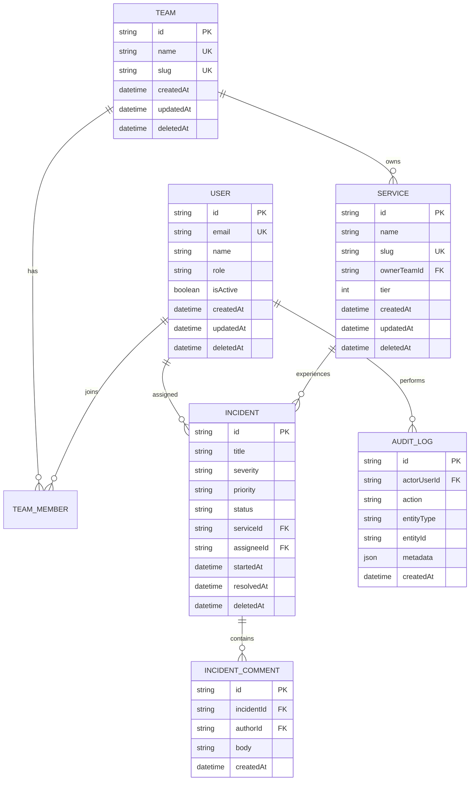

# PlusOps Initial ER Diagram

```mermaid
erDiagram
  USER ||--o{ TEAM_MEMBER : joins
  TEAM ||--o{ TEAM_MEMBER : has
  TEAM ||--o{ SERVICE : owns
  SERVICE ||--o{ INCIDENT : experiences
  USER ||--o{ INCIDENT : assigned
  INCIDENT ||--o{ INCIDENT_COMMENT : contains
  USER ||--o{ AUDIT_LOG : performs

  USER {
    string id PK
    string email UK
    string name
    string role
    boolean isActive
    datetime createdAt
    datetime updatedAt
    datetime deletedAt
  }

  TEAM {
    string id PK
    string name UK
    string slug UK
    datetime createdAt
    datetime updatedAt
    datetime deletedAt
  }

  SERVICE {
    string id PK
    string name
    string slug UK
    string ownerTeamId FK
    int tier
    datetime createdAt
    datetime updatedAt
    datetime deletedAt
  }

  INCIDENT {
    string id PK
    string title
    string severity
    string priority
    string status
    string serviceId FK
    string assigneeId FK
    datetime startedAt
    datetime resolvedAt
    datetime deletedAt
  }

  INCIDENT_COMMENT {
    string id PK
    string incidentId FK
    string authorId FK
    string body
    datetime createdAt
  }

  AUDIT_LOG {
    string id PK
    string actorUserId FK
    string action
    string entityType
    string entityId
    json metadata
    datetime createdAt
  }
```

