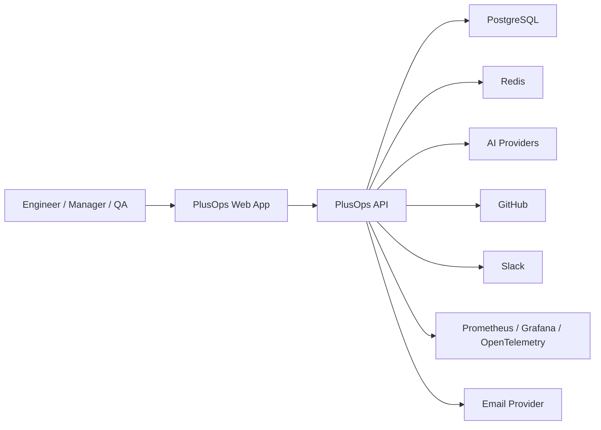
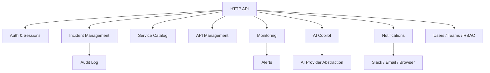
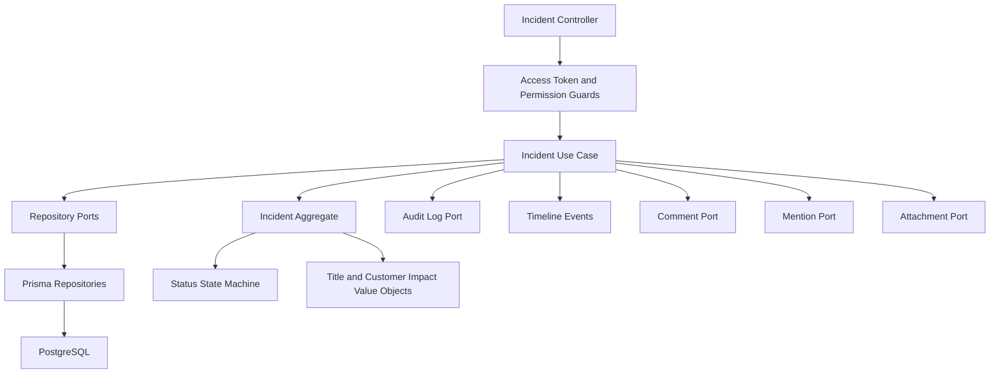
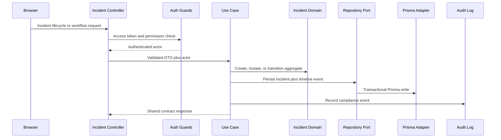
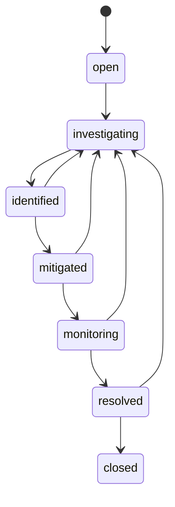
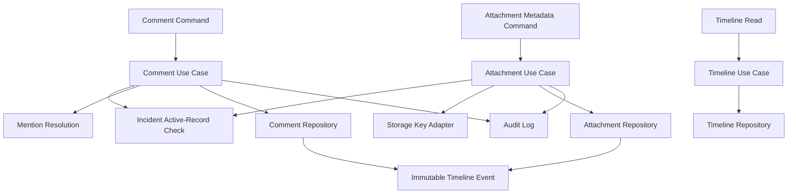

# PlusOps Architecture Overview

## Product Boundary

PlusOps is an internal developer platform for engineering organizations. It centralizes service ownership, incident response, API operations, observability, AI assistance, and collaboration workflows.

## System Context

## Backend Module Map

## Incident Domain Architecture

Milestone 3 models incidents as a workflow-oriented domain, not as a simple CRUD table.

The current incident module exposes lifecycle endpoints for create, list, detail read, detail update, soft delete, explicit workflow commands, comments, mentions, attachment metadata, and a read-only activity timeline. Prisma remains isolated in infrastructure repositories, while use cases enforce RBAC, ownership-aware rules, audit logging, and timeline event generation. Notifications, monitoring ingestion, realtime updates, dashboard integration, and S3-backed attachment storage are intentionally deferred.

### Incident Lifecycle and Workflow Flow

### Incident Workflow State Machine

Resolve, reopen, and close use dedicated commands rather than the generic status endpoint because those actions carry stronger audit and timeline meaning than ordinary intermediate status changes.

## Incident Collaboration Architecture

Comments are editable collaboration records. Timeline events are immutable activity records. Mentions are stored separately from comment bodies so future notification workflows can read mention rows directly without reparsing historical text.

## Data Ownership

Each domain module owns its persistence model and exposes behavior through application use cases. Cross-module reads should happen through application ports or read models, not direct repository access across module boundaries.

## First Production Concerns

- Authentication and authorization must be designed before protected features.
- Audit logging must cover high-risk actions such as incident status changes, role changes, and service ownership changes.
- Observability must expose health, latency, error rate, and queue metrics from the beginning.
- AI features must use provider abstractions so OpenAI, Claude, Groq, and Gemini can be swapped per use case.
- External integrations must isolate provider-specific SDKs behind ports.

## Deployment Shape

Initial deployment can run as:

- Static web app on S3 plus CloudFront.
- API service on ECS, EC2, or container platform.
- PostgreSQL on RDS.
- Redis on ElastiCache.
- Object storage on S3 for incident attachments.
- GitHub Actions for CI/CD.
