# PlusOps Architecture Overview

## Product Boundary

PlusOps is an internal developer platform for engineering organizations. It centralizes service ownership, incident response, API operations, observability, AI assistance, and collaboration workflows.

## System Context

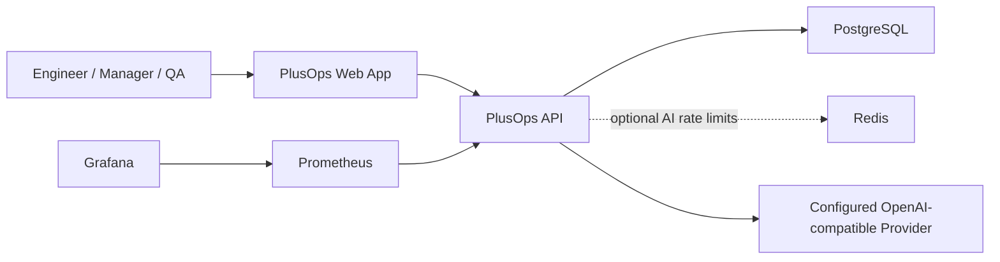

## Backend Module Map

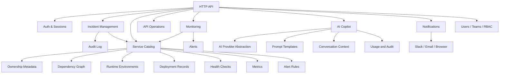

## Frontend Product Architecture

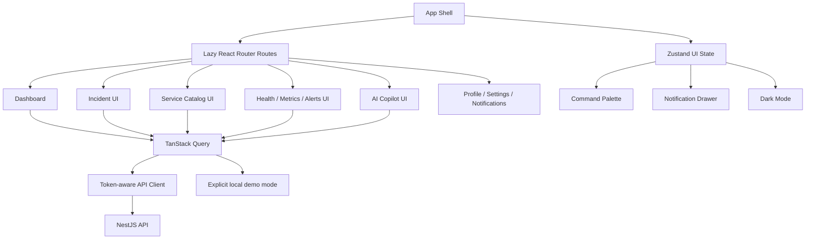

The frontend keeps server state in TanStack Query and local interaction state in Zustand. This avoids copying API responses into a global client store while still allowing UI concerns such as the command palette, notification drawer, selected records, and theme to remain fast and local.

The API client attaches the current JWT access token when available and attempts a refresh once on unauthorized responses. Live mode surfaces backend errors and never silently replaces them with demo data. Typed demo data is available only when `VITE_PLUSOPS_DATA_MODE=demo` is deliberately enabled for local UI inspection.

The React app is route-split by product area:

- Dashboard
- Incident list and incident detail
- Service catalog and service detail
- Health, metrics, and alert surfaces
- AI Copilot workspace
- Profile, settings, and notifications

The UI favors dense operational layouts over marketing screens: tables, filters, status badges, charts, timeline records, drawers, command navigation, loading skeletons, empty states, and error states.

## Service Catalog Architecture

Milestone 4 starts observability from the service boundary instead of from raw infrastructure resources.

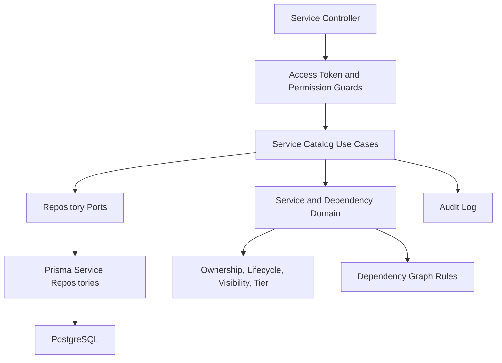

Services are stable ownership boundaries. Incidents, deployments, metrics, health checks, alerts, and runbooks attach to a service without coupling PlusOps to transient pods, containers, or hosts. Health runs execute configured HTTP, TCP, dependency, or PostgreSQL probes; outbound network targets must match `HEALTH_CHECK_ALLOWED_HOSTS`. Product cache probes remain explicitly unsupported because the application Redis instance is scoped to AI rate limiting, not service dependency monitoring. Metrics and alert evaluation operate on persisted PlusOps samples. External Prometheus/OpenTelemetry ingestion, notifications, and automatic incident creation remain deferred.

## Service Health Architecture

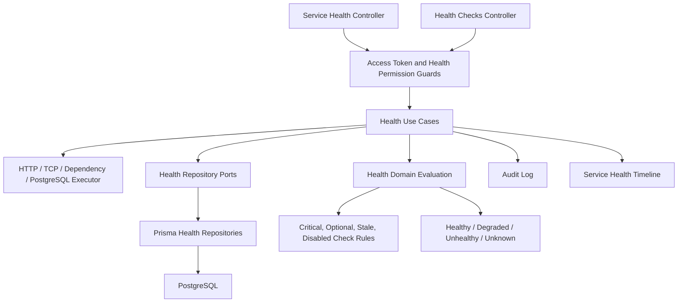

Health checks are modeled before metrics because they are operational decision signals. A liveness or readiness check tells Kubernetes and load balancers whether a process should stay alive or receive traffic. Metrics explain trends and causes later; health checks establish whether the service can currently perform its expected work.

The executor records measured latency and the observed outcome. It does not accept a caller-supplied result. A missing target, disallowed host, disabled check, unsupported cache probe, or stale observation becomes `unknown` instead of fabricated success.

## Metrics Foundation Architecture

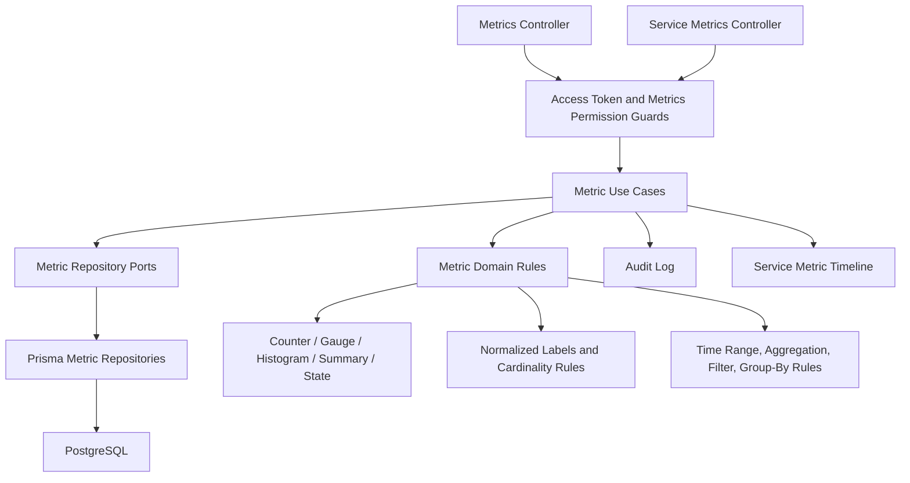

Metrics are modeled as service-owned time-series definitions rather than provider-specific Prometheus objects. Metric definitions describe the measurement, series identify a unique label set and source, samples store timestamped values, and retention policies describe how long future storage should keep data. This keeps Prometheus and OpenTelemetry as future adapters instead of core domain dependencies.

## Metrics Query and Alert Rule Architecture

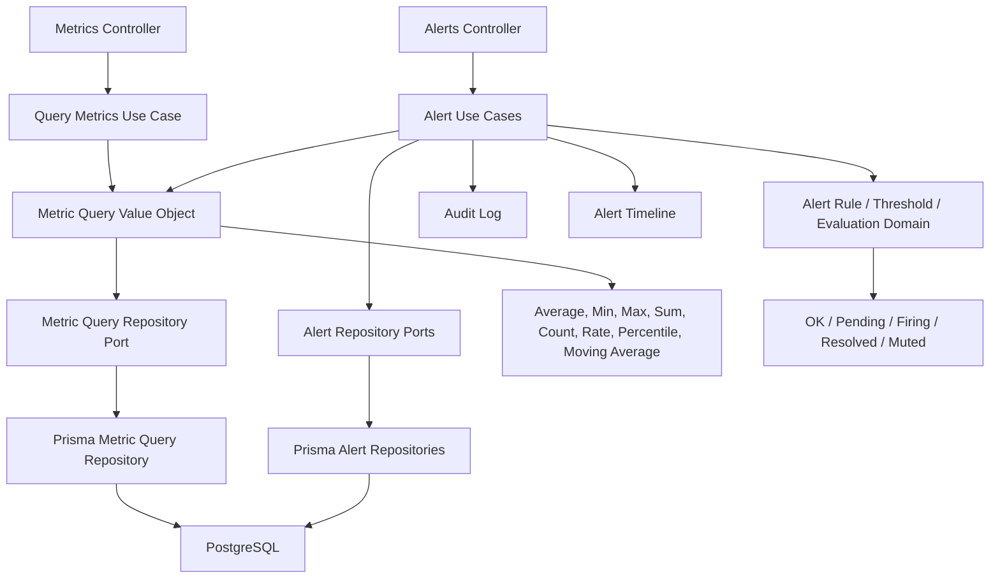

The query engine converts stored samples into operational answers through time range filters, label filters, aggregation, group-by, sorting, and pagination. Alert rules depend on the metric query port instead of Prisma directly, so a future Prometheus adapter can replace the query implementation without rewriting alert use cases or controllers.

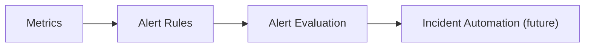

## AI Copilot Platform Architecture

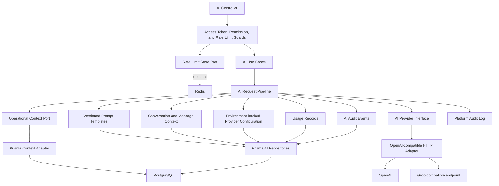

The AI platform is provider-agnostic at the application boundary. Authenticated AI requests pass through a Redis-backed distributed rate-limit guard before reaching use cases. The pipeline loads authoritative incident, service, health, metric, alert, dependency, ownership, and timeline context from PostgreSQL before calling the configured OpenAI-compatible endpoint. The system prompt requires separate facts, interpretation, recommended actions, and uncertainty. Caller-supplied context is treated as a hint, not as an authoritative fact source. Without `AI_API_KEY` and `AI_MODEL`, AI requests return a clear `503` configuration error; there is no fake runtime fallback. If optional Redis is unavailable, the rate limiter fails open and readiness reports degraded while PostgreSQL-backed workflows continue.

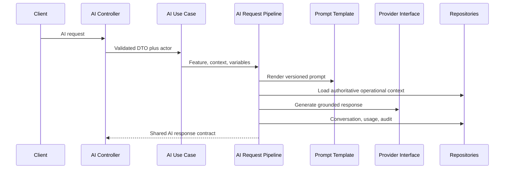

Current AI capabilities are chat, playground, log analysis, stack trace explanation, incident summarization, SQL generation, API documentation generation, and release note generation. Provider calls are real when configured. Streaming, RAG, embeddings, vector databases, agents, function calling, MCP, browser automation, voice, and vision are intentionally deferred.

## Application Observability

The NestJS API emits structured JSON request-completion logs with request IDs, normalized routes, status codes, and latency. A version-neutral `/api/internal/metrics` endpoint exports `prom-client` request, error, duration, Node.js process, AI rate-limit decision, and Redis availability metrics. Prometheus scrapes that endpoint and Grafana is provisioned with a real API dashboard. The readiness endpoint queries required PostgreSQL and reports optional Redis as healthy, degraded, or disabled.

These are telemetry about PlusOps itself. The service metrics shown inside the product are still persisted samples supplied by the deterministic seed or metric submission API; PlusOps does not yet ingest external production telemetry.

## Incident Domain Architecture

Milestone 3 models incidents as a workflow-oriented domain, not as a simple CRUD table.

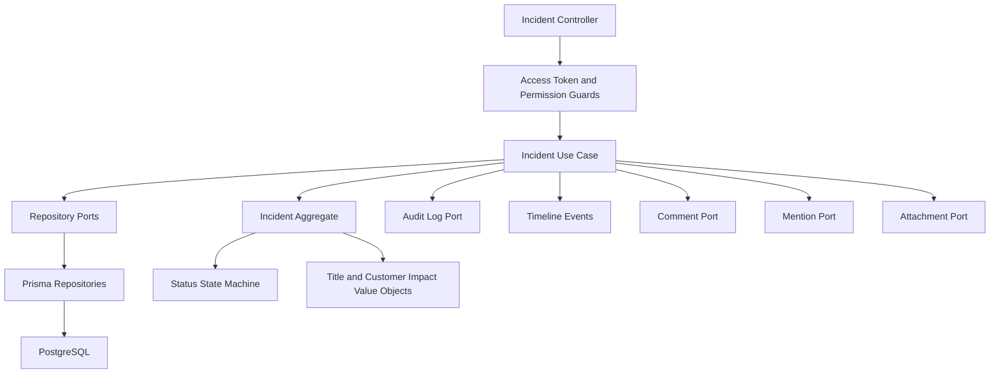

The current incident module exposes lifecycle endpoints for create, list, detail read, detail update, soft delete, explicit workflow commands, comments, mentions, local development file upload/download, attachment metadata, and a read-only activity timeline. Prisma remains isolated in infrastructure repositories, while use cases enforce RBAC, ownership-aware rules, audit logging, and timeline event generation. File bytes are kept behind a storage port and written beneath `.plusops/uploads` by the local adapter; production object storage such as S3 remains intentionally deferred.

### Incident Lifecycle and Workflow Flow

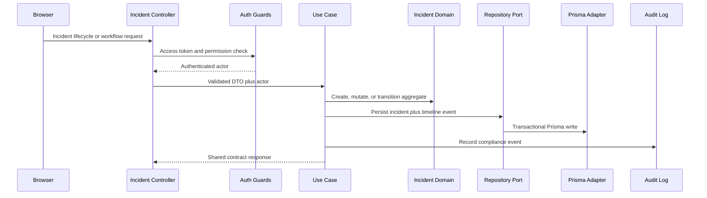

### Incident Workflow State Machine

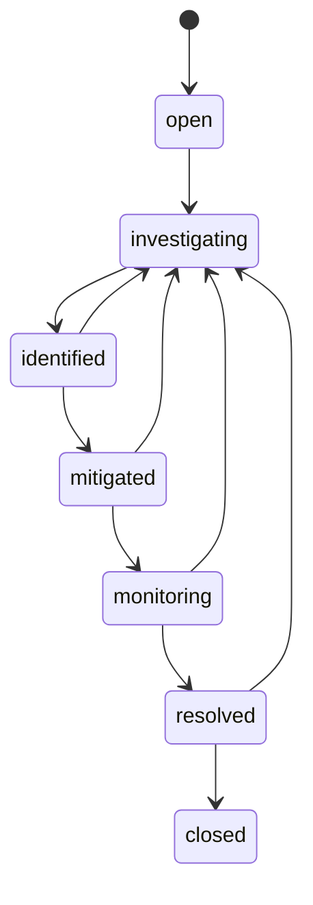

Resolve, reopen, and close use dedicated commands rather than the generic status endpoint because those actions carry stronger audit and timeline meaning than ordinary intermediate status changes.

## Incident Collaboration Architecture

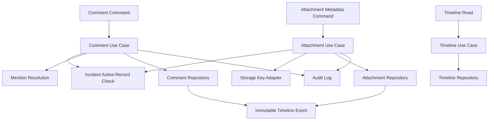

Comments are editable collaboration records. Timeline events are immutable activity records. Mentions are stored separately from comment bodies so future notification workflows can read mention rows directly without reparsing historical text.

## Data Ownership

Each domain module owns its persistence model and exposes behavior through application use cases. Cross-module reads should happen through application ports or read models, not direct repository access across module boundaries.

## First Production Concerns

- Authentication and authorization must be designed before protected features.
- Audit logging must cover high-risk actions such as incident status changes, role changes, and service ownership changes.
- Observability must expose health, latency, error rate, and queue metrics from the beginning.
- AI features use provider abstractions so OpenAI, Claude, Groq, and Gemini can be swapped per use case.
- External integrations must isolate provider-specific SDKs behind ports.

## Deployment Shape

The credible current deployment boundary is intentionally small:

- React static assets served by the web container or a static host.
- One stateless NestJS API container.
- PostgreSQL for application state, sessions, audit records, and operational domain data.
- Prometheus and Grafana for self-observability where the environment can keep the metrics endpoint private.
- Durable object storage is required before local attachment bytes are considered production-ready.

Redis is an optional runtime dependency used only for distributed AI rate limiting. Kafka, Kubernetes, and AWS-specific services are not runtime requirements and should be introduced only when a measured scaling or delivery need justifies them.
