# PlusOps Architecture Overview

## Product Boundary

PlusOps is an internal developer platform for engineering organizations. It centralizes service ownership, incident response, API operations, observability, AI assistance, and collaboration workflows.

## System Context

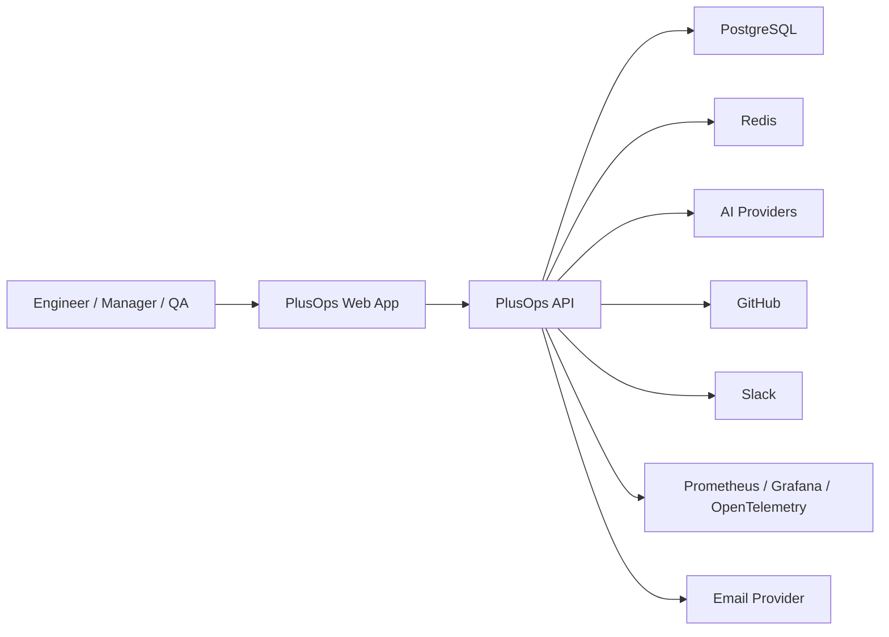

## Backend Module Map

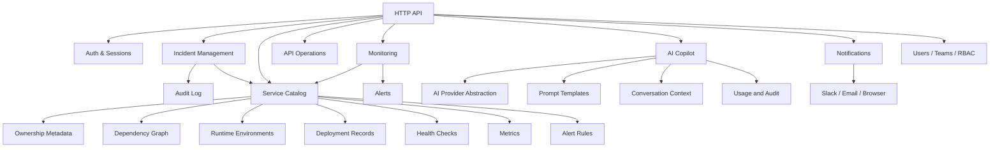

## Service Catalog Architecture

Milestone 4 starts observability from the service boundary instead of from raw infrastructure resources.

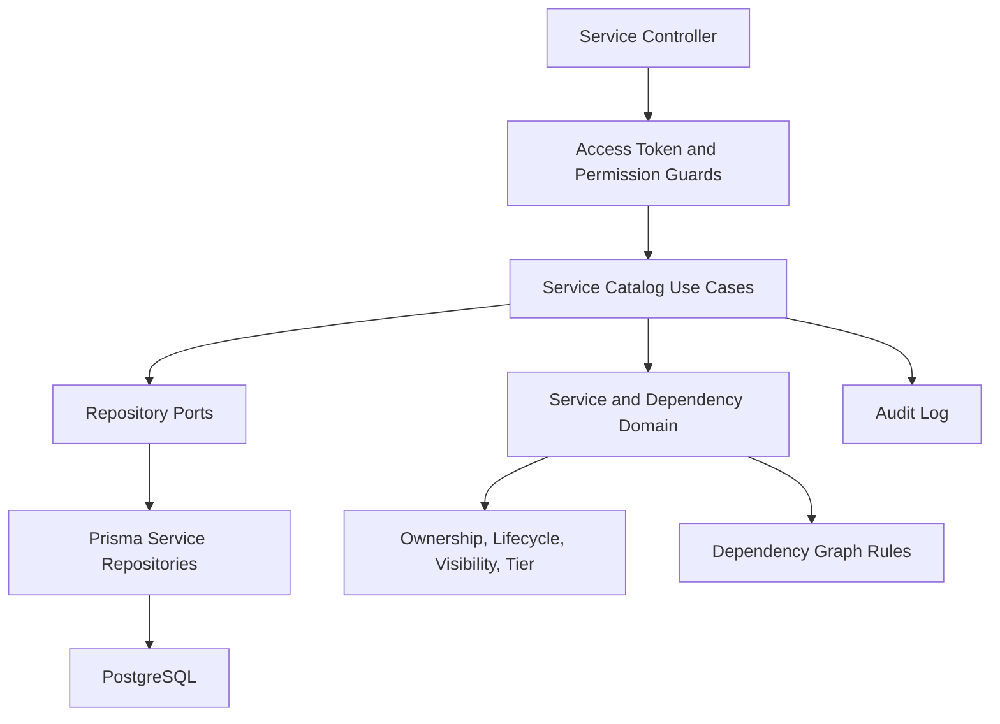

Services are stable ownership boundaries. Incidents, deployments, metrics, health checks, alerts, and runbooks can all attach to a service without coupling PlusOps to transient pods, containers, or hosts. Phase 1 includes service metadata, team ownership, environments, dependencies, deployment records, RBAC, soft archive, pagination, filtering, sorting, Swagger metadata, and graph cycle prevention. Phase 2 adds backend health check configuration, simulated check runs, service health evaluation, history, audit logging, and service health timeline events. Phase 3 adds metric definitions, labels, series, samples, retention references, metric RBAC, audit logging, and metric timeline events. Phase 4 adds Prisma-backed query execution, alert rules, alert evaluation, alert timeline events, and alert RBAC. It intentionally does not scrape Prometheus, ingest OpenTelemetry, send notifications, create incidents automatically, render dashboards, or expose frontend workflows yet.

## Service Health Architecture

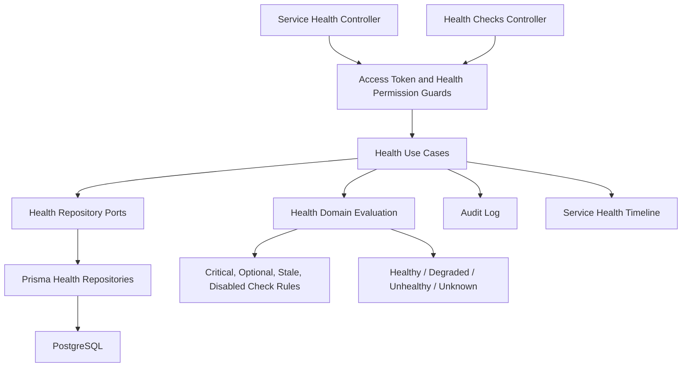

Health checks are modeled before metrics because they are operational decision signals. A liveness or readiness check tells Kubernetes and load balancers whether a process should stay alive or receive traffic. Metrics explain trends and causes later; health checks establish whether the service can currently perform its expected work.

## Metrics Foundation Architecture

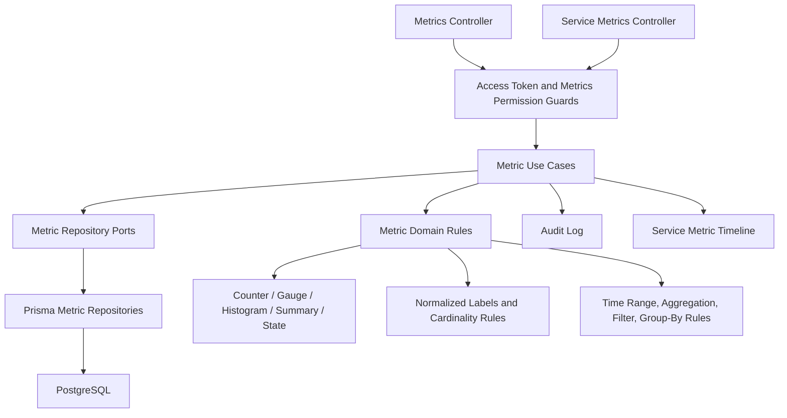

Metrics are modeled as service-owned time-series definitions rather than provider-specific Prometheus objects. Metric definitions describe the measurement, series identify a unique label set and source, samples store timestamped values, and retention policies describe how long future storage should keep data. This keeps Prometheus and OpenTelemetry as future adapters instead of core domain dependencies.

## Metrics Query and Alert Rule Architecture

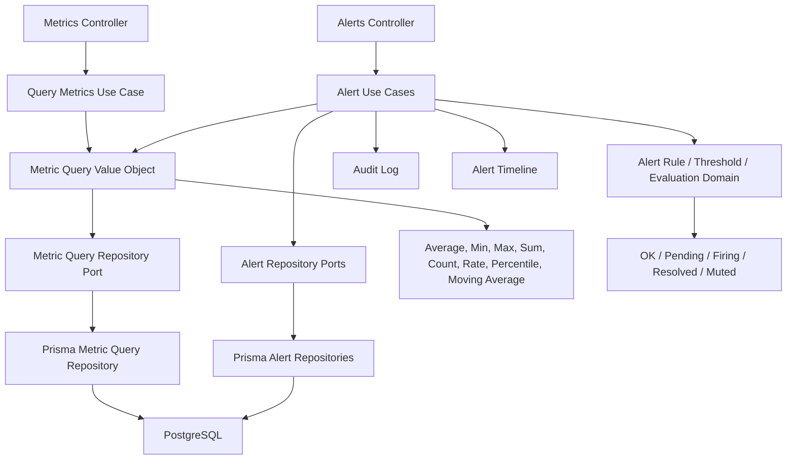

The query engine converts stored samples into operational answers through time range filters, label filters, aggregation, group-by, sorting, and pagination. Alert rules depend on the metric query port instead of Prisma directly, so a future Prometheus adapter can replace the query implementation without rewriting alert use cases or controllers.

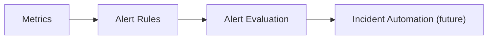

## AI Copilot Platform Architecture

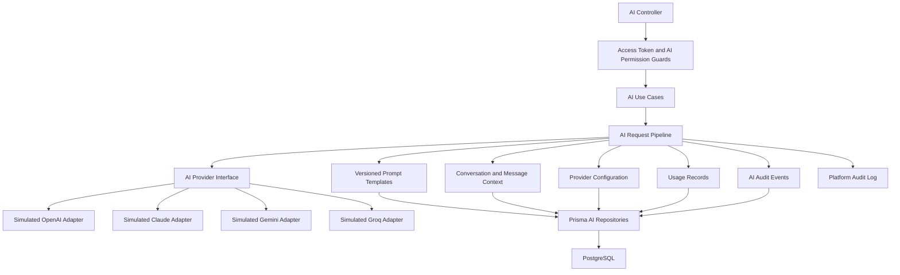

The AI platform is deliberately provider-agnostic. Product use cases call the AI request pipeline and provider interface, not a vendor SDK. Today every provider adapter returns simulated responses so the architecture, RBAC, prompt rendering, conversation persistence, usage tracking, and audit logging can mature before real API keys exist. Later OpenAI, Claude, Gemini, or Groq adapters can make real calls behind the same interface without changing incident, observability, SQL, documentation, or release-note workflows.

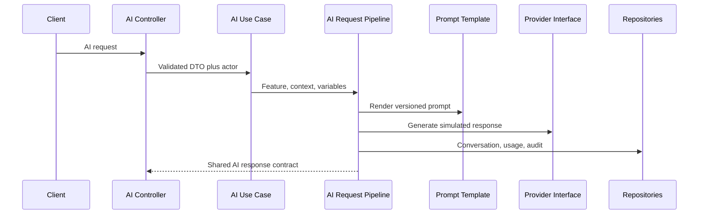

Current AI capabilities are chat, playground, log analysis, stack trace explanation, incident summarization, SQL generation, API documentation generation, and release note generation. Real provider API calls, streaming, RAG, embeddings, vector databases, agents, function calling, MCP, browser automation, voice, and vision are intentionally deferred.

## Incident Domain Architecture

Milestone 3 models incidents as a workflow-oriented domain, not as a simple CRUD table.

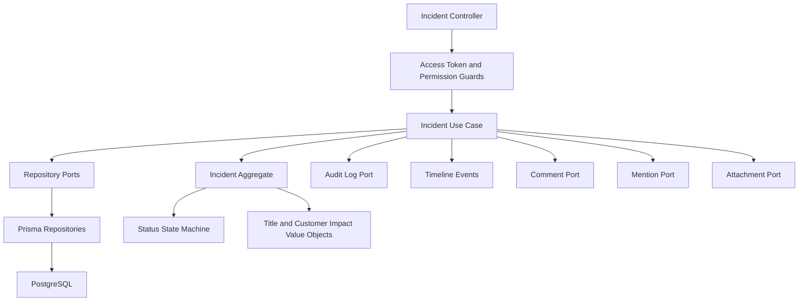

The current incident module exposes lifecycle endpoints for create, list, detail read, detail update, soft delete, explicit workflow commands, comments, mentions, attachment metadata, and a read-only activity timeline. Prisma remains isolated in infrastructure repositories, while use cases enforce RBAC, ownership-aware rules, audit logging, and timeline event generation. Notifications, monitoring ingestion, realtime updates, dashboard integration, and S3-backed attachment storage are intentionally deferred.

### Incident Lifecycle and Workflow Flow

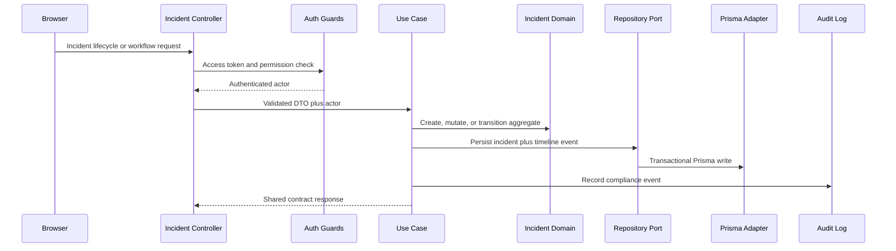

### Incident Workflow State Machine

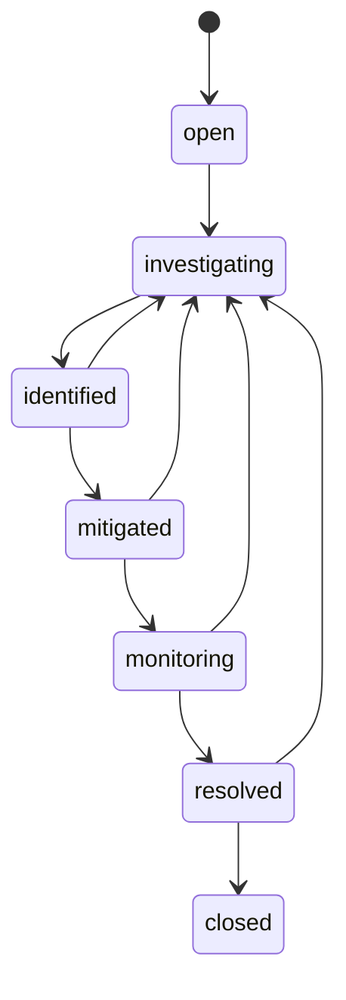

Resolve, reopen, and close use dedicated commands rather than the generic status endpoint because those actions carry stronger audit and timeline meaning than ordinary intermediate status changes.

## Incident Collaboration Architecture

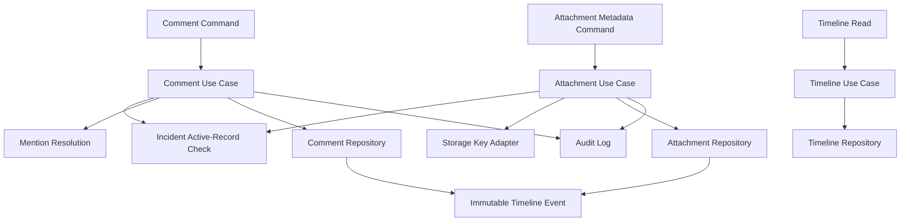

Comments are editable collaboration records. Timeline events are immutable activity records. Mentions are stored separately from comment bodies so future notification workflows can read mention rows directly without reparsing historical text.

## Data Ownership

Each domain module owns its persistence model and exposes behavior through application use cases. Cross-module reads should happen through application ports or read models, not direct repository access across module boundaries.

## First Production Concerns

- Authentication and authorization must be designed before protected features.
- Audit logging must cover high-risk actions such as incident status changes, role changes, and service ownership changes.
- Observability must expose health, latency, error rate, and queue metrics from the beginning.
- AI features use provider abstractions so OpenAI, Claude, Groq, and Gemini can be swapped per use case.
- External integrations must isolate provider-specific SDKs behind ports.

## Deployment Shape

Initial deployment can run as:

- Static web app on S3 plus CloudFront.
- API service on ECS, EC2, or container platform.
- PostgreSQL on RDS.
- Redis on ElastiCache.
- Object storage on S3 for incident attachments.
- GitHub Actions for CI/CD.
