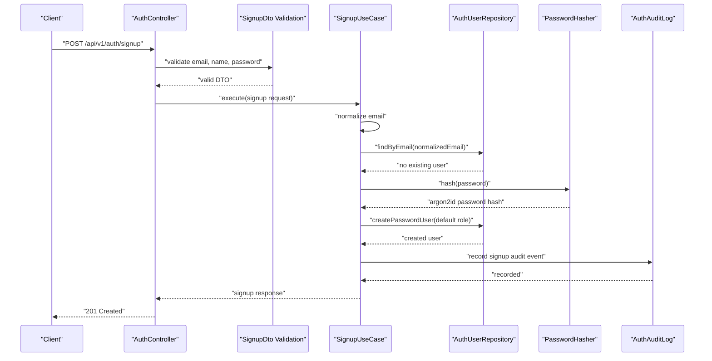
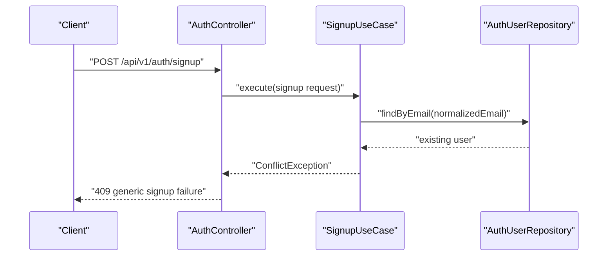
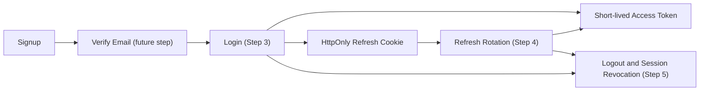
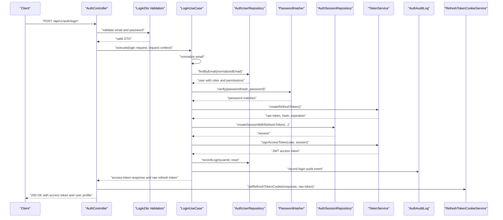
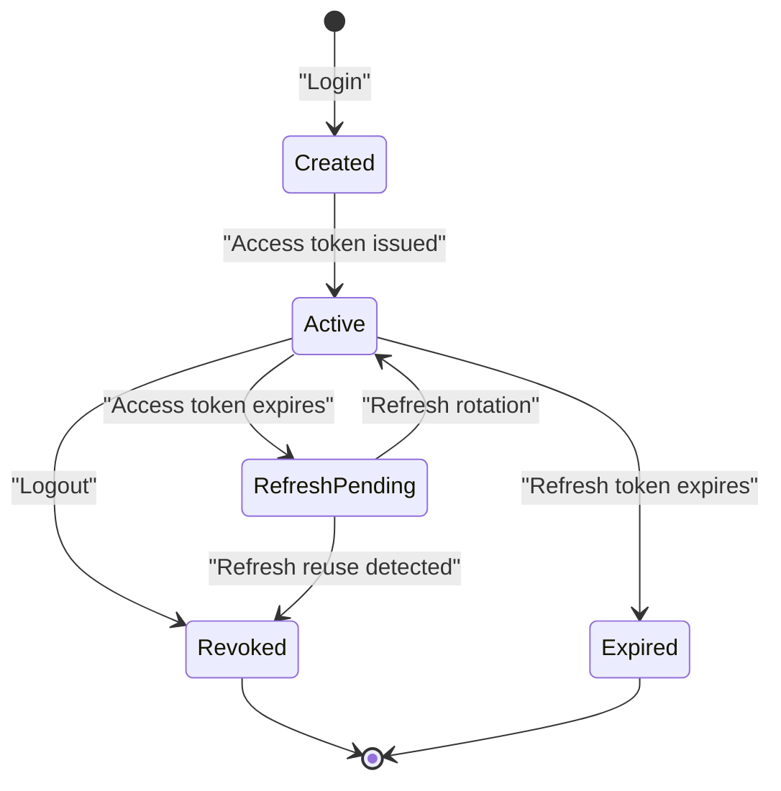
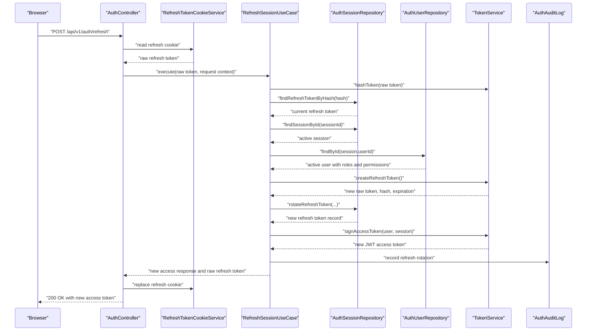
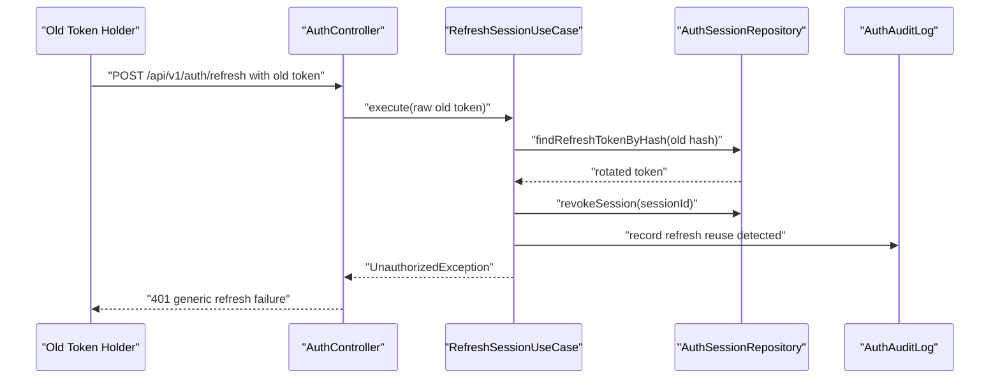
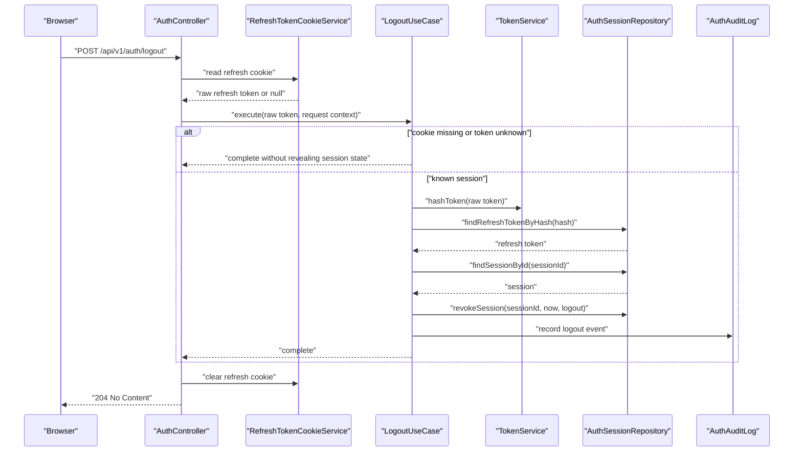
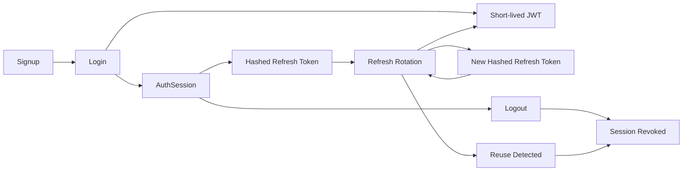

# Milestone 2: Authentication and Authorization

## Goal

Build production-oriented authentication and authorization for PlusOps without redesigning the Milestone 1 architecture.

Milestone 2 is intentionally split into phases so each security decision can be understood, implemented, and reviewed before the next layer is added.

## Phase 1: Auth Architecture Foundation

Phase 1 defines the backend data model, shared contracts, module boundary, domain types, and ports. It does not expose authentication endpoints yet.

## Problem

Authentication is not just a login form. A production system needs to answer:

- Who is the user?
- Which sessions are active?
- Can this session be revoked?
- Which roles and permissions apply?
- How are email verification and password reset tokens stored safely?
- Where will audit events be recorded?

## Architecture

The auth module follows the existing Clean Architecture direction:

```text
Controller
  -> Use Case
    -> Repository/Security Port
      -> Prisma, JWT, Argon2, Email Provider
```

Phase 1 adds the lower-level contracts for those layers:

- Domain types for users, sessions, refresh tokens, and one-time tokens.
- Repository ports for users, sessions, and email/password-reset tokens.
- Security ports for password hashing and token issuing.
- Audit logging port for high-risk auth events.
- Shared Zod contracts for frontend/backend request and response shapes.

## Database Design

### User

Stores the account identity, profile fields, password hash, email verification status, active/deleted state, and login timestamps.

### Role, Permission, UserRole, RolePermission

Roles are user-friendly bundles. Permissions are enforcement-level capabilities. This lets PlusOps start with RBAC and later add granular policy checks without changing protected endpoint structure.

### AuthSession

Represents a browser/device session. Sessions can be listed, revoked individually, or revoked in bulk after password reset or compromise.

### RefreshToken

Stores only hashed refresh tokens. Each refresh token belongs to a session and can point to the token that replaced it during rotation.

### EmailVerificationToken and PasswordResetToken

Stores hashed one-time tokens with expiration and consumed timestamps. Raw tokens should only appear in emails or reset links, never in the database.

### OAuthAccount

Stores external identity mappings for future Google and GitHub login without forcing a later user-table redesign.

## Technology Choices

- Prisma models define relational integrity, uniqueness, and indexes.
- Zod contracts keep frontend and backend auth payloads aligned.
- NestJS module boundaries keep auth separate from incidents and future product modules.
- Ports keep use cases independent from Argon2, JWT, Prisma, and email providers.

## Trade-Offs

- Data-backed RBAC is more complex than a role enum, but avoids hardcoded `isAdmin` checks.
- Stateful refresh sessions require database writes, but enable logout, rotation, reuse detection, and device management.
- Separate one-time token tables are more explicit than a generic token table, but easier to explain and maintain at this stage.
- OAuth is modeled but not implemented, keeping Phase 1 future-ready without adding login providers too early.

## Interview Notes

Explain this phase as:

"I separated identity, sessions, and authorization. Access tokens can be short-lived and stateless, but refresh tokens are stateful because they need revocation and rotation. Roles are stored as permission bundles so the application can enforce permissions instead of scattering role-name checks across controllers."

Common follow-up questions:

1. Why not store raw refresh tokens?
2. Why not keep roles as an enum?
3. Why model sessions separately from refresh tokens?
4. Why use ports instead of calling Prisma directly from use cases?
5. How would Google or GitHub login fit into this model?

## Phase 1 Completion Criteria

- Auth and RBAC Prisma models exist.
- Shared auth contracts exist.
- Auth NestJS module boundary exists.
- Domain types and application ports exist.
- ADRs document token/session and RBAC decisions.

## Phase 2: Authentication Core

Phase 2 implements backend authentication behavior one step at a time. It does not include frontend auth screens, OAuth login, email delivery, MFA, or WebAuthn.

### Step 1: Infrastructure Implementations

Step 1 adds concrete adapters behind the Phase 1 ports:

- Prisma user repository.
- Prisma session and refresh-token repository.
- Prisma email verification and password reset token repository.
- Prisma auth audit log repository.
- Argon2id password hasher.
- JWT access token and opaque token service.
- Clock abstraction for deterministic expiration tests.

Controllers still do not expose auth endpoints in this step.

### Step 1 Design Notes

Use cases should depend on ports, not infrastructure details. That keeps signup, login, refresh, and logout business rules independent from Prisma, Argon2, JWT signing, and token hashing.

Refresh tokens, email verification tokens, and password reset tokens are generated as opaque random values. PlusOps stores only an HMAC hash of those tokens so leaked database rows do not reveal usable credentials.

Argon2id is used for password hashing because it is memory-hard and designed to resist GPU/ASIC cracking better than older password hashing approaches. The work factor should be calibrated per deployment environment as infrastructure matures.

### Step 1 Testing

Step 1 tests cover:

- Argon2id hashing and verification.
- Malformed password hash failure behavior.
- JWT access token signing and expiration calculation.
- Opaque token hashing and timing-safe verification.
- Duration parsing used by token TTL configuration.
- Prisma auth user mapper behavior for roles and permissions.

### Step 2: Signup

Step 2 adds the first backend authentication endpoint:

- `POST /api/v1/auth/signup`
- DTO validation for email, name, and password policy.
- Email normalization before lookup and persistence.
- Duplicate email rejection.
- Argon2id password hashing.
- Default `developer` role assignment.
- Signup audit event creation.
- Response without access or refresh tokens.

Signup does not log the user in. Account creation is not the same thing as verified account ownership.

### Signup Sequence



Duplicate email flow:



### Authentication Flow Status



### Step 2 Testing

Step 2 tests cover:

- Successful signup.
- Duplicate email rejection.
- Email normalization.
- Password hashing before persistence.
- Default role assignment.
- Audit log creation.
- DTO validation failures.

### Step 3: Login and Session Establishment

Step 3 adds authenticated session creation:

- `POST /api/v1/auth/login`
- DTO validation for email and password.
- Email normalization before lookup.
- Generic authentication failures for unknown email, wrong password, disabled account, and optional unverified email enforcement.
- Argon2id password verification.
- Transactional `AuthSession` and first `RefreshToken` creation.
- Short-lived JWT access token generation.
- Opaque refresh token stored only as a hash.
- HttpOnly refresh-token cookie.
- Last-login timestamp update.
- Login audit event creation.

Login creates a session; it does not implement password reset, email verification delivery, OAuth, MFA, or frontend auth screens.

### Login Sequence



### Session Lifecycle



### Cookie Configuration

Refresh tokens are written to a cookie with:

- `HttpOnly`: browser JavaScript cannot read the refresh token.
- `Secure`: enabled in production so the cookie is only sent over HTTPS.
- `SameSite=Lax`: reduces cross-site request risk while keeping normal top-level navigation usable.
- `Path=/api/v1/auth`: only auth endpoints receive the refresh cookie.
- `Max-Age` and `Expires`: align the browser cookie with the refresh token record expiration.
- `Domain`: configurable for production subdomain sharing, left unset locally.

Access tokens are returned in the response body because they are short-lived and intended for explicit API authorization headers. Refresh tokens are longer-lived and therefore receive stricter browser storage controls.

### Step 3 Testing

Step 3 tests cover:

- Successful login.
- Wrong password.
- Unknown email.
- Email normalization.
- Disabled user rejection.
- Optional unverified-email rejection.
- Hashed refresh token persistence.
- Session creation.
- Access token payload contents.
- Refresh cookie creation.
- Login audit logging.
- DTO validation failures.

### Step 4: Refresh Token Rotation and Session Renewal

Step 4 adds secure session continuity:

- `POST /api/v1/auth/refresh`
- Refresh token read from the configured HttpOnly cookie.
- Refresh token hashing and database lookup.
- Session validation.
- User/account-state validation.
- Old refresh token rotation and revocation.
- New opaque refresh token generation.
- New JWT access token generation.
- Refresh cookie replacement.
- Refresh audit event creation.
- Reuse detection for already-rotated refresh tokens.

Refresh renewal is separate from logout, password reset, email verification, OAuth, MFA, and frontend behavior.

### Refresh Sequence



### Reuse Detection



PlusOps treats the `AuthSession` and its refresh token chain as the refresh token family. Reuse of an already-rotated token is a compromise signal, so the session family is revoked.

### Step 4 Testing

Step 4 tests cover:

- Successful refresh.
- Invalid refresh token.
- Expired refresh token.
- Revoked refresh token.
- Refresh token hashing and lookup.
- Refresh token rotation inputs.
- Old rotated token rejection.
- Rotation conflict handling.
- Refresh cookie extraction and replacement.
- Refresh audit logging.

### Step 5: Logout and Session Revocation

Step 5 completes the core backend session lifecycle:

- `POST /api/v1/auth/logout`
- Refresh token read from the configured HttpOnly cookie.
- Refresh token hashing and database lookup.
- Session lookup through the repository port.
- Server-side session and refresh-token revocation.
- Idempotent `204 No Content` response for missing, invalid, or already revoked cookies.
- Refresh cookie clearing with matching cookie attributes.
- Logout audit event creation when a known session is found.

Logout does not implement password reset, email verification, OAuth, MFA, frontend authentication screens, device management UI, or a logout-all-devices endpoint.

### Logout Sequence



### Logout Security Notes

Deleting the browser cookie is not enough because a copied refresh token could still be replayed from another client. PlusOps revokes the server-side `AuthSession`, which also revokes active refresh tokens in that session family.

Access JWTs are not blacklisted in this step. They are intentionally short-lived and stateless, so normal API authorization can stay fast. Logout immediately removes the ability to mint future access tokens, while any already issued access token naturally expires soon after. Enterprise deployments that need immediate access-token invalidation can add token introspection, a revocation cache, or shorter access-token TTLs.

Cookie clearing must match the original cookie name, path, domain, `SameSite`, and `Secure` behavior. Browsers identify cookies by name plus scope, so clearing with different attributes can leave the original refresh cookie behind.

Logout-all-devices would use the same repository capability as password reset or suspicious activity response, but it is intentionally deferred until account/session management UI exists.

### Step 5 Testing

Step 5 tests cover:

- Successful logout.
- Missing refresh cookie.
- Invalid refresh token.
- Already revoked session.
- Refresh cookie clearing with matching production attributes.
- Session revocation reason and timestamp.
- Logout audit logging.

These tests exist because logout should be safe to call repeatedly, should not leak whether a token is valid, and must remove server-side refresh authority even when the browser cookie is also cleared.

### Backend Auth Lifecycle Status



## Remaining Work

Core backend session lifecycle is now implemented through signup, login, refresh rotation, and logout. Remaining Milestone 2 work should stay focused on authorization guards, email verification, password reset, and frontend authentication screens.
