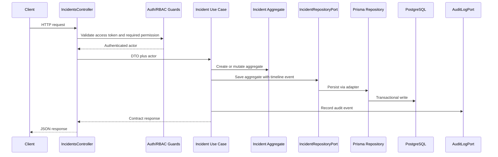
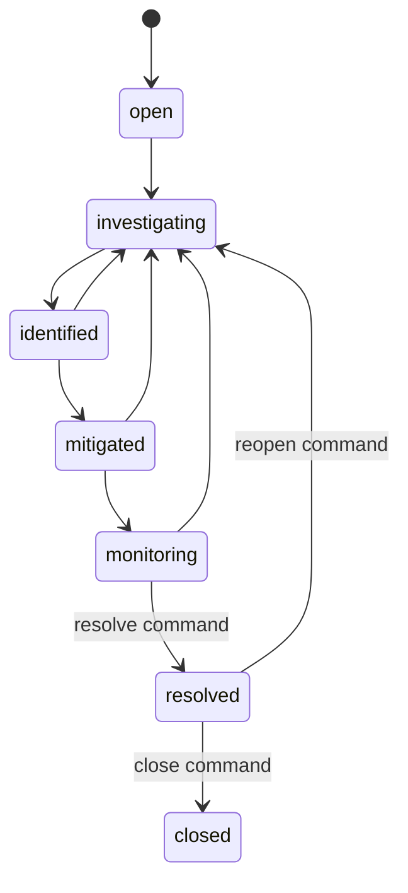
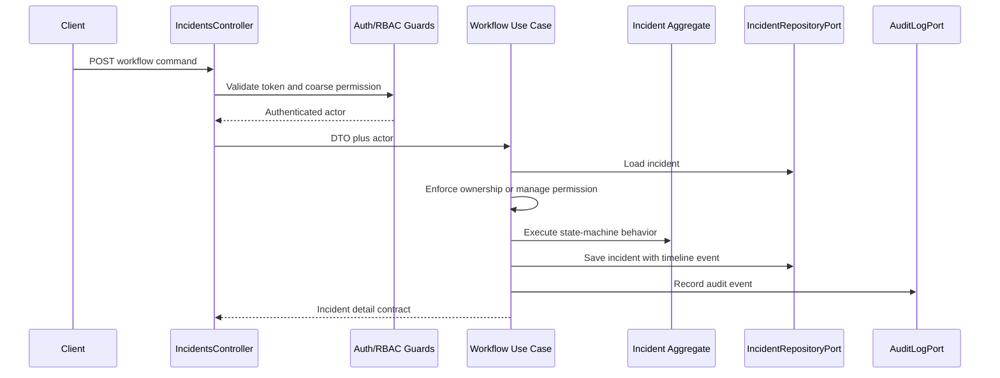
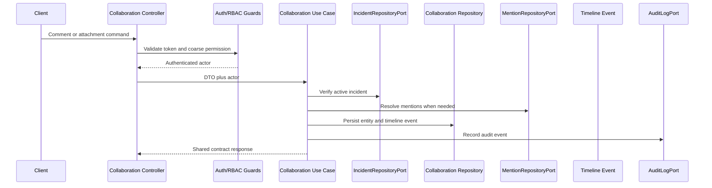

# Milestone 3: Incident Management Core

## Goal

Build the incident management domain that powers PlusOps operational workflows without weakening the architecture established in Milestones 1 and 2.

Milestone 3 intentionally starts with domain understanding and domain architecture before CRUD, controllers, Prisma repositories, or frontend workflows.

## Phase 0: Domain and Product Understanding

Phase 0 defined the product problem:

- Incidents are production or operational events that degrade customer experience, reliability, compliance, or business operations.
- Incident management software is coordination infrastructure, not just issue tracking.
- Jira, Slack, and PagerDuty solve parts of the workflow, but PlusOps needs a durable source of truth for status, ownership, timeline, customer impact, and post-incident learning.

## Phase 1: Domain Modeling and Database Design

Phase 1 approved the Incident aggregate blueprint:

- `Incident` is the aggregate root.
- `Comment`, `TimelineEvent`, and `Attachment` belong to the incident workflow.
- `User`, `Team`, `Service`, `Runbook`, `Deployment`, and `Environment` are referenced because they have their own lifecycles.
- Timeline history is product-visible operational history.
- Audit logs remain separate compliance and security evidence.
- Incidents are soft deleted by default.
- Status changes follow a domain state machine.

## Phase 2: Incident Domain Architecture

Phase 2 creates the architecture that future incident features will use. It does not expose CRUD endpoints and does not implement Prisma persistence.

### Folder Structure

```text
apps/api/src/modules/incidents/
  domain/
    customer-impact.value-object.ts
    incident.entity.ts
    incident.enums.ts
    incident-comment.entity.ts
    incident-timeline-event.entity.ts
    incident-attachment.entity.ts
  application/
    ports/
      incident-repository.port.ts
      incident-comment-repository.port.ts
      incident-timeline-repository.port.ts
    use-cases/
      create-incident.use-case.ts
      get-incident.use-case.ts
      list-incidents.use-case.ts
      update-incident.use-case.ts
      assign-incident.use-case.ts
      change-incident-status.use-case.ts
      change-incident-severity.use-case.ts
      resolve-incident.use-case.ts
      reopen-incident.use-case.ts
      close-incident.use-case.ts
  infrastructure/
    persistence/
      placeholder repository providers (Phase 2 only)
  incidents.module.ts
  incidents.tokens.ts
```

### Architecture

```text
Future Controller
  -> Use Case
    -> Repository Port
      -> Future Prisma Repository
        -> PostgreSQL
```

Controllers are deliberately absent in this phase. The old smoke-test incidents endpoint has been removed from module wiring so Milestone 3 can begin from domain architecture rather than demo CRUD.

### Domain Behavior

The `Incident` entity exposes behavior:

- `assign()`
- `unassign()`
- `changeSeverity()`
- `changePriority()`
- `changeStatus()`
- `resolve()`
- `reopen()`
- `close()`
- `markDeleted()`
- `restoreFromDeletion()`

These methods belong in the domain layer because status, severity, deletion, and lifecycle rules must be consistent no matter whether the action comes from HTTP, background jobs, monitoring ingestion, or a future AI assistant.

### State Machine

```text
open
  -> investigating
    -> identified
      -> mitigated
        -> monitoring
          -> resolved
            -> closed
```

Rollback and reopening rules are domain concerns:

- `identified -> investigating`
- `mitigated -> investigating`
- `monitoring -> investigating`
- `resolved -> investigating`

Invalid transitions throw domain errors before persistence is involved.

### Repository Ports

Use cases will depend on:

- `IncidentRepositoryPort`
- `IncidentCommentRepositoryPort`
- `IncidentTimelineRepositoryPort`

Phase 2 registered placeholder repository providers so dependency tokens were explicit without pretending persistence existed. Phase 3 replaces those placeholders with Prisma repositories.

### Shared Contracts

`packages/contracts` now defines:

- status, severity, and priority schemas
- pagination query and metadata schemas
- incident summary contracts
- incident detail contracts
- comment, timeline, and tag contracts
- create, update, assignment, status-change, and severity-change request contracts

The frontend and backend should use these contracts as the single source of truth when Phase 3 introduces endpoints.

## Validation Strategy

- DTO validation belongs at the presentation layer and protects HTTP payload shape.
- Domain validation belongs in entities and value objects and protects invariants.
- Business-rule validation belongs in use cases when rules require repository reads, permissions, or transactions.

## Phase 2 Completion Criteria

- Incident domain entity and value objects exist.
- Domain enums and state-machine guards exist.
- Repository ports exist without Prisma implementations.
- Use-case boundaries exist without CRUD logic.
- Incident module wires use cases and repository tokens.
- Shared contracts describe future API request and response shapes.
- Unit tests cover domain behavior, value objects, and enum/state validation.

## Phase 3: Incident Lifecycle Operations

Phase 3 implements the first complete backend business capability for incidents. It is intentionally not generic CRUD: creating or updating an incident now means enforcing RBAC, validating request/domain state, persisting through repository ports, writing timeline evidence, and recording audit logs.

The Phase 2 sections above are retained as historical architecture notes. The current implementation has replaced the temporary persistence placeholders with Prisma repositories and an authenticated HTTP controller.

### Delivered Backend Surface

- `POST /api/v1/incidents` creates an incident.
- `GET /api/v1/incidents` lists incidents with pagination, filtering, sorting, and active-record defaults.
- `GET /api/v1/incidents/:incidentId` returns an incident detail projection.
- `PATCH /api/v1/incidents/:incidentId` updates editable incident details.
- `DELETE /api/v1/incidents/:incidentId` performs a soft delete.

Comment endpoints, timeline endpoints, attachments, notifications, AI, WebSockets, and dashboard integration remain deferred. Status workflow operations are implemented in Phase 4.

### Phase 3 Folder Structure

```text
apps/api/src/modules/incidents/
  domain/
    incident.entity.ts
    incident-comment.entity.ts
    incident-timeline-event.entity.ts
    incident-attachment.entity.ts
    incident-title.value-object.ts
    customer-impact.value-object.ts
  application/
    incident-permissions.ts
    mappers/
      incident-response.mapper.ts
    ports/
      incident-repository.port.ts
      incident-comment-repository.port.ts
      incident-timeline-repository.port.ts
    use-cases/
      create-incident.use-case.ts
      get-incident.use-case.ts
      list-incidents.use-case.ts
      update-incident.use-case.ts
      delete-incident.use-case.ts
      assign-incident.use-case.ts
      change-incident-status.use-case.ts
      change-incident-severity.use-case.ts
      resolve-incident.use-case.ts
      reopen-incident.use-case.ts
      close-incident.use-case.ts
  infrastructure/
    persistence/
      incident-prisma.mappers.ts
      prisma-incident.repository.ts
      prisma-incident-comment.repository.ts
      prisma-incident-timeline.repository.ts
  presentation/
    http/
      incidents.controller.ts
      dtos/
        create-incident.dto.ts
        list-incidents-query.dto.ts
        update-incident.dto.ts
  incidents.module.ts
  incidents.tokens.ts
```

### Request Flow



### Permission Decisions

- `Viewer` can read incident lists and details only.
- `Developer` and `QA Engineer` can create incidents.
- `Developer` and `QA Engineer` can update or soft delete incidents they reported or are assigned to.
- `Engineering Manager` and `Admin` can manage incidents across teams through `incidents:manage`.
- Deleted incident visibility requires `incidents:manage`.

Controllers use coarse permission guards such as `incidents:read` and `incidents:write`. Use cases enforce ownership-aware rules because ownership requires loading the incident aggregate.

### Persistence Decisions

- Prisma is isolated in infrastructure repositories.
- Incident, comment, and timeline repositories implement application ports.
- Incident saves can include timeline events so creation, update, and soft-delete evidence is persisted atomically.
- Lists exclude soft-deleted incidents by default.
- Filtering supports status, severity, priority, service, assignee, search, and deleted-record inclusion.
- Sorting supports created, updated, started, status, severity, and priority fields.

### Validation Strategy In Practice

- DTO validation rejects malformed HTTP payloads and query strings.
- Domain validation protects title, customer impact, lifecycle, and soft-delete invariants.
- Use-case validation enforces permissions, ownership, service existence, and deleted-record visibility.
- Persistence validation is left to Prisma constraints, relations, and indexes.

### Phase 3 Testing

Tests now cover:

- Incident domain behavior.
- Incident permission rules.
- Create, get, list, update, and soft-delete use cases.
- Timeline event generation.
- Audit logging.
- Controller delegation.
- DTO validation.
- Boolean query parsing for `includeDeleted`.
- Pagination metadata.
- Prisma repository filtering, sorting, enum mapping, soft-delete filtering, and transactional timeline persistence.

## Phase 4: Incident Workflow Engine

Phase 4 turns incident status from a stored string into an operational workflow. The goal is not to add more CRUD routes, but to expose explicit commands that represent how engineering teams coordinate incident response.

### Delivered Backend Surface

- `POST /api/v1/incidents/:incidentId/assign` assigns or unassigns the incident owner.
- `POST /api/v1/incidents/:incidentId/status` moves an incident through normal intermediate states.
- `POST /api/v1/incidents/:incidentId/severity` changes severity with manager-level authorization.
- `POST /api/v1/incidents/:incidentId/resolve` resolves a monitored incident with an optional resolution summary.
- `POST /api/v1/incidents/:incidentId/reopen` reopens a resolved incident with a required reason.
- `POST /api/v1/incidents/:incidentId/close` closes a resolved incident.

Notifications, monitoring ingestion, AI, WebSockets, Kafka, and dashboard integration remain deferred. Comments, attachment metadata, mentions, and read-only timeline APIs are implemented in Phase 5.

### Workflow State Machine



The generic status endpoint deliberately refuses `resolved`, `closed`, and `resolved -> investigating` transitions. Those transitions require dedicated commands because they carry stronger product meaning and need explicit audit/timeline context.

### Workflow Request Flow



### Permission Decisions

- `Viewer` remains read-only.
- `Developer` and `QA Engineer` can move incidents they reported or are assigned to through normal workflow states.
- `Engineering Manager` and `Admin` can manage cross-team workflow changes through `incidents:manage`.
- Assignment and severity changes require `incidents:manage` because they affect ownership, escalation, reporting, and operational priority.

Controllers enforce coarse permissions. Use cases enforce ownership-aware decisions after loading the incident because ownership and assignee rules are domain data, not route metadata.

### Timeline and Audit Evidence

Workflow commands append product-visible timeline events for assignment changes, status changes, severity changes, resolve, reopen, and close.

The same commands record compliance-focused audit actions. Timeline answers "what happened during the incident?" Audit answers "who performed a sensitive action, when, and against what entity?"

### Phase 4 Testing

Tests now cover:

- valid state transitions
- invalid state transitions before persistence
- dedicated resolve, reopen, and close command behavior
- close-before-resolve rejection
- assignment permission checks
- active assignee validation
- severity management permission
- timeline event generation
- audit logging
- controller delegation
- workflow DTO validation

## Phase 5: Collaboration Layer

Phase 5 transforms incident management from a lifecycle record into a collaborative operational workspace. It is not a chat system. Comments, mentions, attachment metadata, and timeline activity are structured collaboration data around the incident.

### Delivered Backend Surface

- `POST /api/v1/incidents/:incidentId/comments` adds a comment.
- `GET /api/v1/incidents/:incidentId/comments` lists comments with pagination.
- `PATCH /api/v1/comments/:commentId` edits a comment.
- `DELETE /api/v1/comments/:commentId` soft deletes a comment.
- `POST /api/v1/incidents/:incidentId/attachments` stores attachment metadata.
- `GET /api/v1/incidents/:incidentId/attachments` lists attachment metadata.
- `DELETE /api/v1/attachments/:attachmentId` soft deletes attachment metadata.
- `GET /api/v1/incidents/:incidentId/timeline` returns the read-only activity feed.

Notifications, email, Slack, WebSockets, Kafka, AI, monitoring ingestion, dashboard widgets, realtime updates, status pages, and S3 storage remain deferred.

### Collaboration Model

Comments are human-authored discussion. They have authors, edit timestamps, soft deletion, and mention relationships.

Timeline events are immutable operational history. They record important facts such as incident creation, assignment changes, status changes, comment creation, comment edits, and attachment additions.

Attachments are metadata-only evidence records. The system stores filename, content type, size, uploader, upload timestamp, and storage key. It does not store file bytes or integrate with S3 yet.

Mentions are stored separately from comments so future notification fan-out can read mention rows directly instead of reparsing comment bodies on every request.

### Collaboration Request Flow



### Permission Decisions

- `Viewer` can read comments, attachments, and timeline only.
- `Developer` and `QA Engineer` can comment, upload attachment metadata, edit their own comments, and delete their own comments or attachment metadata.
- `Engineering Manager` and `Admin` can edit or delete any comment and manage attachment metadata across incidents.
- Deleted incidents reject new collaboration writes because collaboration should not continue on inactive incident records.

### Timeline Activity Feed

The timeline API exposes one chronological activity feed regardless of source. Comment and attachment actions append timeline events, so the feed can show lifecycle changes and collaboration activity together without joining comments, attachments, and workflow history on every request.

### Phase 5 Testing

Tests cover:

- comment creation, editing, and soft deletion
- ownership-aware comment permissions
- mention parsing and unknown mention rejection
- attachment metadata validation and storage-key creation
- attachment metadata persistence
- read-only timeline pagination and chronological ordering
- DTO validation for collaboration payloads
- Prisma repository transactions for comments, mentions, attachments, and timeline events
- controller delegation for collection and item routes

## Interview Explanation

"I did not start with CRUD because incident management is workflow-heavy. I modeled Incident as an aggregate root and put lifecycle behavior in the domain so controllers and persistence adapters cannot bypass state-machine rules. Collaboration entities stay outside the aggregate because comments, mentions, and attachments have independent ownership and notification behavior. Use cases depend on repository ports, so Prisma repositories, HTTP controllers, workflow commands, and collaboration APIs can be added without coupling the domain to the database."
