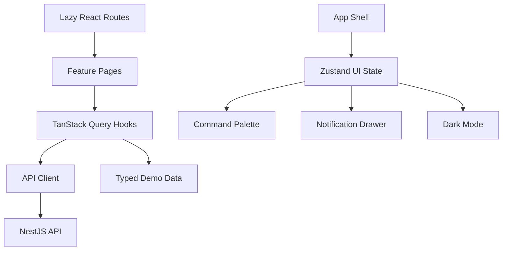

# Milestone 6: Frontend Product Beta

## Goal

Milestone 6 turns PlusOps from a backend API platform into a usable internal engineering product. The milestone focuses on React product surfaces, typed API integration, operational UX, and frontend architecture. It does not redesign the backend or introduce new backend product capabilities.

## Scope

Implemented frontend surfaces:

- Dashboard
- Incident Management
- Incident creation, detail, timeline, comments, file upload/download, and workflow actions
- Service Catalog
- Service detail, dependencies, health summary, metrics summary, and deployments
- Health checks and health history
- Metrics query UI with charting
- Alert rules and simulated evaluation
- AI Copilot chat, provider selection, engineering copilots, usage cards, and playground
- Profile
- Settings
- Notification Center UI

## Architecture



Server state remains in TanStack Query. UI state remains in Zustand. This keeps API data cacheable, invalidatable, and scoped to backend resources while allowing local UI interactions to stay simple.

## UX Decisions

- The first screen is the operational dashboard, not a landing page.
- Navigation is organized around engineering workflows: incidents, services, health, metrics, alerts, and AI.
- Recharts powers observability visualizations.
- Skeletons, empty states, error states, and toasts make loading and failure states explicit.
- Ctrl+K opens the command palette without storing server state globally.
- The notification center is UI-only for this milestone.
- Read screens call the backend in live mode and surface API errors. Typed beta demo fallbacks are available only when `VITE_PLUSOPS_DATA_MODE=demo` is explicitly enabled for local UI inspection.

## Backend Boundaries

This milestone consumes the existing API:

- `/api/v1/incidents`
- `/api/v1/services`
- `/api/v1/health-checks`
- `/api/v1/metrics`
- `/api/v1/alerts`
- `/api/v1/ai`
- `/api/v1/auth`

No backend architecture changes are required for this frontend milestone.

## Phase 2: Seed Architecture and Demo Data

Phase 2 proves the platform works as one integrated system instead of isolated screens. It adds an explicit Prisma seed workflow that creates deterministic local development data across auth, RBAC, teams, services, environments, dependencies, incidents, comments, timeline events, health checks, metric series, metric samples, alert rules, alert history, and simulated AI provider configuration.

The seed data tells one connected operational story:

```text
Payments API latency rises
   |
   v
Checkout and Payments health degrade
   |
   v
Latency and queue-depth alerts fire
   |
   v
An incident exists with comments, mentions, attachment metadata, and timeline events
   |
   v
Metrics, health, alerts, incidents, services, and AI configuration all describe the same environment
```

The local flow is now:

```bash
pnpm infra:up
pnpm db:generate
pnpm db:migrate
pnpm db:seed
pnpm dev
```

Seeded records use stable identifiers and idempotent upserts so `pnpm db:seed` can be rerun safely. Metric samples and health timestamps are refreshed relative to the seed run so local dashboards and last-hour metric queries stay useful without introducing random values.

## Testing

Frontend tests cover:

- UI component rendering
- Status badge rendering
- Metric card rendering
- Notification page rendering
- Zustand UI state
- Query key boundaries
- Typed beta demo data consistency

Broader browser-level end-to-end tests are safe to add after the frontend routes stabilize.

## Deferred

- Full authentication screens
- Profile API integration
- Realtime notification delivery
- WebSocket collaboration
- Production deployment
- Marketing site
- Backend feature changes

## Interview Notes

Explain this milestone as the point where PlusOps becomes a product, not just a set of APIs. The important design choice is state ownership: TanStack Query owns server state, Zustand owns UI state, and shared contracts keep the frontend/backend boundary typed.

The explicit demo mode exists to make local and recruiter UI inspection possible without a running backend while still preserving the real API integration. In live mode, seeded data, auth flows, and backend availability are required; API failures are not silently replaced.
